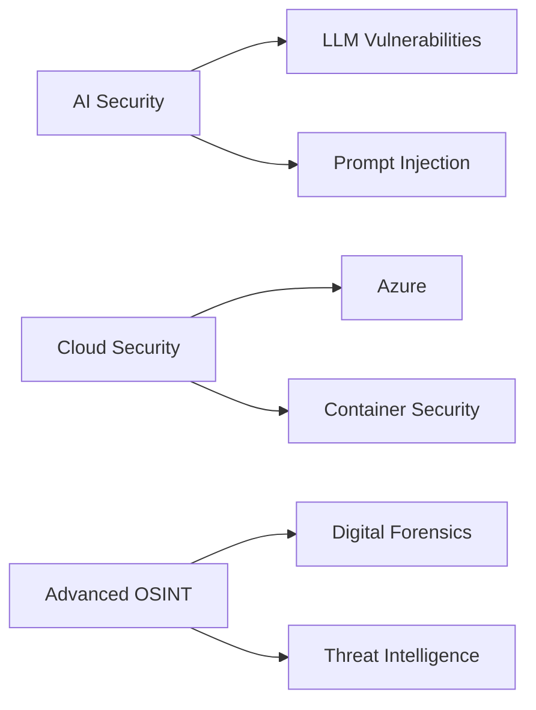

<div align="center">

<!-- Hero Banner -->


<!-- Animated Typing -->
<h1>
  
</h1>

<!-- Badges Row 1 -->
<p>
  <a href="https://unitarity.netlify.app">
    
  </a>
  <a href="https://twitter.com/kkYrusobad">
    
  </a>
  <a href="https://www.linkedin.com/in/kkYrusobad/">
    
  </a>
</p>

<!-- Badges Row 2 -->
<p>
  
  
  
</p>

</div>

---

<div align="center">

### 🎯 **Focus Areas**

<table>
<tr>
<td align="center" width="25%">
<br/>
<b>Security Research</b><br/>
<sub>Web • Network • OSINT</sub>
</td>
<td align="center" width="25%">
<br/>
<b>AI/ML Integration</b><br/>
<sub>LLMs • Automation</sub>
</td>
<td align="center" width="25%">
<br/>
<b>Linux Engineering</b><br/>
<sub>Automation • DevOps</sub>
</td>
<td align="center" width="25%">
<br/>
<b>Academic Research</b><br/>
<sub>Publications • Innovation</sub>
</td>
</tr>
</table>

</div>

---

## 🚀 **About Me**

```yaml
name: Prateek
role: Security Researcher & AI Explorer
location: Building at the intersection of AI and Security
current_focus:
  - Exploring LLM security implications
  - Automating security workflows with AI
  - Contributing to open-source security tools
philosophy: "Making technology efficient, secure, and accessible"
```

**What I'm up to:**
- 🔬 Researching AI-powered security automation
- 🛡️ Building CTF challenges and writeups
- 🌱 Growing my digital knowledge garden
- ✍️ Writing technical blogs on security topics

---

## 📊 **GitHub Analytics**

<div align="center">
  
  
</div>

<div align="center">
  
</div>

---

## 🛠️ **Tech Stack**

<div align="center">

### Languages


### Security & Tools


### AI & Automation


### Systems & Platforms


</div>

---

## ✨ **Featured Projects**

<div align="center">

<table>
<tr>
<td width="50%" valign="top">

### 🎨 [Material Startpage](https://github.com/kkYrusobad/kkYrusobad.github.io)
A sleek, customizable browser startpage with material design
- ⚡ Lightning-fast performance
- 🎨 Material design aesthetic
- 🔧 Highly customizable

</td>
<td width="50%" valign="top">

### 🎨 [AbsoluteGruv Theme](https://github.com/kkYrusobad/AbsoluteGruv)
Beautiful Obsidian theme for knowledge management
- 🌙 Dark mode optimized
- 📝 Perfect for PKM workflows
- 🎯 Gruvbox color scheme

</td>
</tr>
<tr>
<td width="50%" valign="top">

### 🔐 [Security Writeups](https://github.com/kkYrusobad/WRITEUPS)
Comprehensive CTF and penetration testing writeups
- 📚 Detailed walkthroughs
- 💡 Learning-focused approach
- 🛡️ Real-world scenarios

</td>
<td width="50%" valign="top">

### ⚙️ [Linux Dotfiles](https://github.com/kkYrusobad/DOTS)
Optimized Linux configuration files
- 🚀 Performance-tuned setup
- 🎨 Beautiful terminal aesthetics
- 🔧 Easy to customize

</td>
</tr>
</table>

</div>

---

## 📝 **Latest Blog Posts**

<div align="center">

<!-- Blog Grid -->
<table>
<tr>
<td align="center" width="33%">
<a href="https://unitarity.netlify.app/en/posts/osint/">
<br/>
<b>OSINT</b><br/>
<sub>Intelligence Gathering</sub>
</a>
</td>
<td align="center" width="33%">
<a href="https://unitarity.netlify.app/en/posts/dns/">
<br/>
<b>DNS</b><br/>
<sub>Domain Name Systems</sub>
</a>
</td>
<td align="center" width="33%">
<a href="https://unitarity.netlify.app/en/posts/http/">
<br/>
<b>HTTP(S)</b><br/>
<sub>Web Protocols</sub>
</a>
</td>
</tr>
<tr>
<td align="center" width="33%">
<a href="https://unitarity.netlify.app/en/posts/netbasics/">
<br/>
<b>Network Basics</b><br/>
<sub>Fundamentals</sub>
</a>
</td>
<td align="center" width="33%">
<a href="https://unitarity.netlify.app/en/posts/previse/">
<br/>
<b>Previse</b><br/>
<sub>HTB Walkthrough</sub>
</a>
</td>
<td align="center" width="33%">
<a href="https://unitarity.netlify.app/en/posts/">
<br/>
<b>View All</b><br/>
<sub>More Posts →</sub>
</a>
</td>
</tr>
</table>

</div>

---

## 🌱 **Current Learning Journey**



---

<div align="center">

## 💬 **Let's Connect**

I'm always open to interesting conversations and collaboration opportunities!

[](mailto:your.email@example.com)
[](https://twitter.com/kkYrusobad)
[](https://www.linkedin.com/in/kkYrusobad/)
[](https://unitarity.netlify.app)

---

### 💭 **Quote of the Moment**

> *"Efficiency is doing better what is already being done."*  
> **— Peter Drucker**

---


**Thanks for visiting!** 🙏 **Feel free to explore and ⭐ star repos you find interesting!**

</div>
